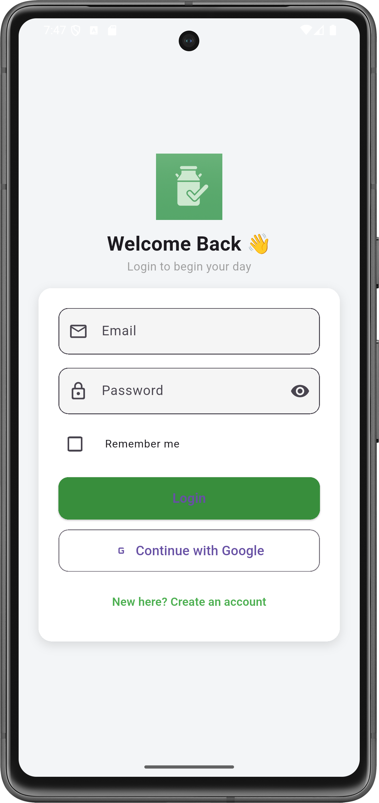
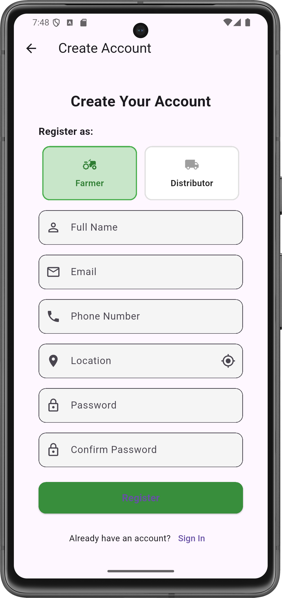
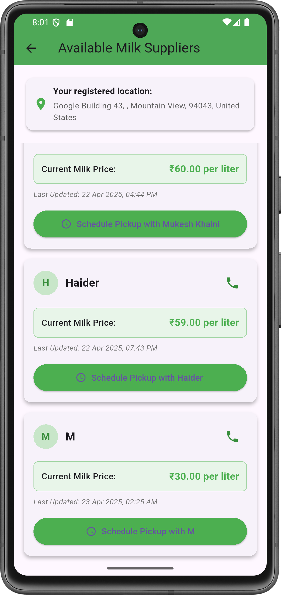
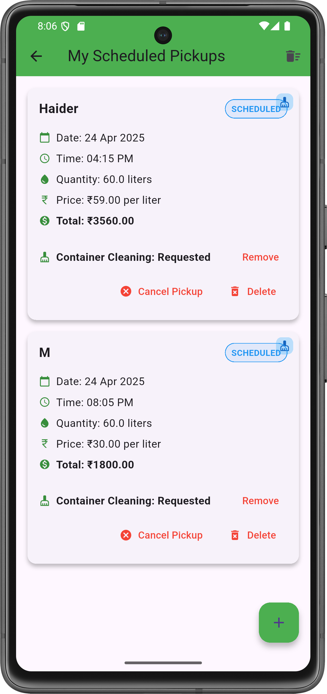
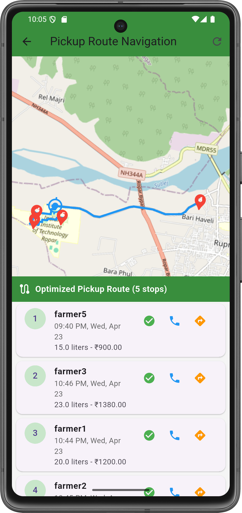
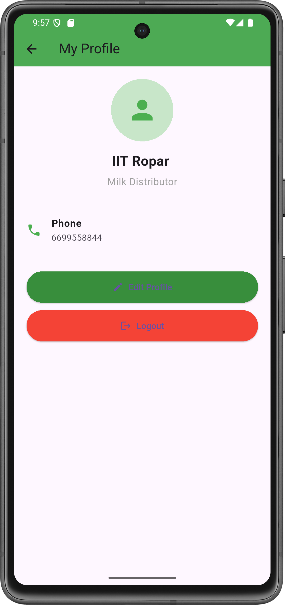

# FarmFlow - A Smart Milk Collection App

## Overview

FarmFlow is a mobile application designed to optimize the milk collection process, connecting farmers and milk collectors efficiently. Farmers can maximize profits by selecting collectors offering the best price per liter, while collectors benefit from optimized routes for efficient milk collection. The app is built using Flutter for the front-end, Firebase for data storage, and the GraphHopper API for route optimization, providing a seamless experience for both farmers and collectors.

## Features

- **User Registration and Profiles**: Farmers and collectors register with their location and manage profiles.
- **Price Setting and Selection**: Collectors set prices per liter; farmers choose collectors based on the highest offered price.
- **Request System**: Farmers send milk collection requests, which collectors can accept or reject based on travel convenience and pricing.
- **Route Optimization**: Collectors receive optimized routes for milk collection using the GraphHopper API to solve the Traveling Salesman Problem (TSP).
- **Transaction Tracking**: Simulated transaction tracking for farmers and collectors (backend implementation pending).
- **Notifications**: Farmers receive updates on scheduled pickups and request statuses.
- **User-Friendly Interface**: Intuitive screens for registration, login, profile management, and route visualization.

## Different Screens of Application

| Login Screen | Registration Screen | Farmer Collector Selection |
|--------------|---------------------|---------------------------|
|  |  |  |

| Collector Requests | Route Optimization | Profile Screen |
|--------------------|--------------------|----------------|
|  |  |  |

## Technologies Used

- **Frontend**: Flutter (Dart)
- **Backend**: Firebase (authentication and data storage)
- **Route Optimization**: GraphHopper API
- **Data Storage**: Firebase Firestore for user data, locations, and collection requests
- **Platform**: Android

## Installation

1. **Clone the Repository**:
   ```bash
   git clone https://github.com/your-username/smart-milk-collection-system.git
2. **Navigate to the Project Directory**:
    ```bash
    cd smart-milk-collection-system
3. **Install Dependencies**: 
    Ensure Flutter is installed, then run:
    ```bash
    flutter pub get
4. **Set Up Firebase**:
    1. Create a Firebase project at [Firebase Console](https://console.firebase.google.com/)
    2. Add an Android app to your Firebase project and download the `google-services.json` file
    3. Place the `google-services.json` file in the `android/app/` directory
    4. Update `lib/firebase_options.dart` with your Firebase configuration

5. **GraphHopper API**
    1. Obtain an API key from [GraphHopper](https://www.graphhopper.com/)
    2. Configure the API key in the route optimization helper file

6. **Run the App**
    ```bash
    flutter run
7. **Usage**

    ### Farmer Workflow:
    - Register with your location and profile details
    - View available collectors and their offered prices
    - Send milk collection requests to preferred collectors
    - Track scheduled pickups and transaction history

    ### Collector Workflow:
    - Register with your location and set the price per liter
    - Accept or reject farmer requests based on convenience
    - View optimized routes for milk collection
    - Track collections and transaction history

8. **Prerequisites**
    - **Flutter**: Version 3.0.0 or higher
    - **Dart**: Version 2.17.0 or higher
    - **Firebase Account**: For authentication and data storage
    - **GraphHopper API Key**: For route optimization
    - **Android Studio**: For emulator or physical device testing

<!-- 9. **Limitations**
    - Transaction system is simulated and not fully implemented in the backend
    - Currently supports Android only; iOS support is not yet implemented
    - Requires stable internet for Firebase and GraphHopper API interactions -->

9. **Future Enhancements**
    - Implement full backend transaction processing
    - Add iOS support for cross-platform compatibility
    - Integrate real-time notifications using Firebase Cloud Messaging
    - Enhance route optimization with additional constraints (e.g., vehicle capacity)
